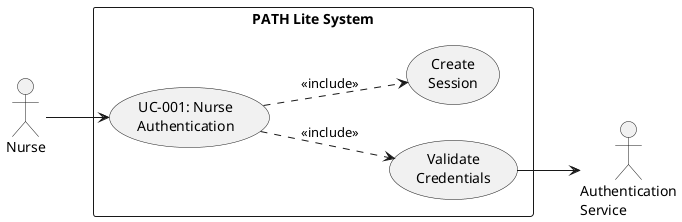
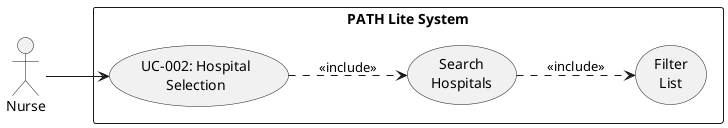
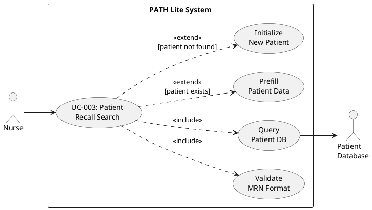
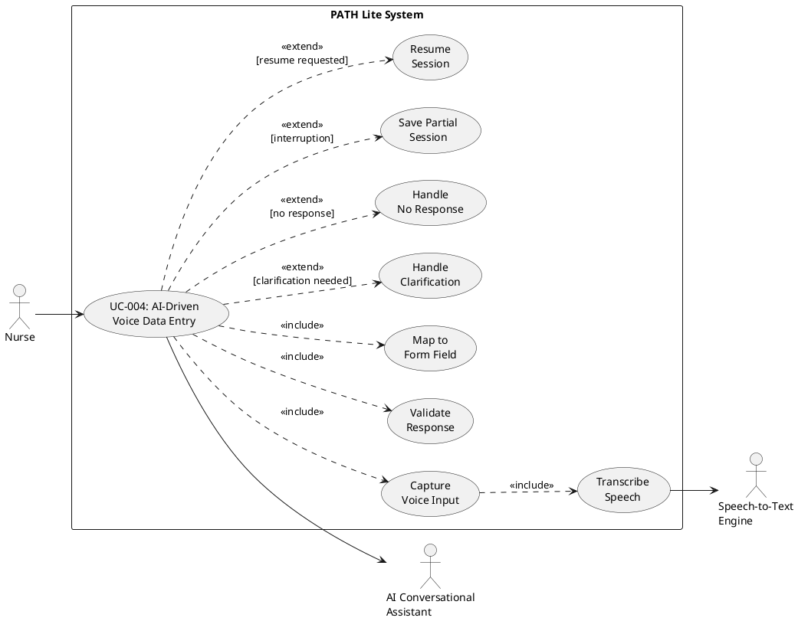
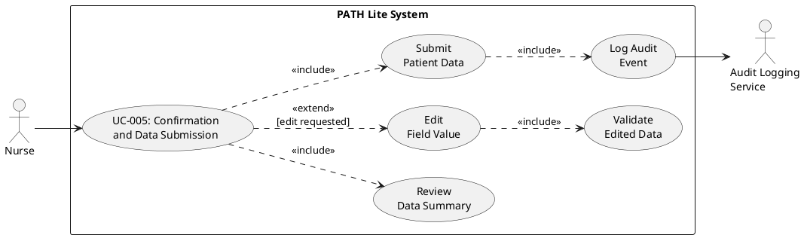
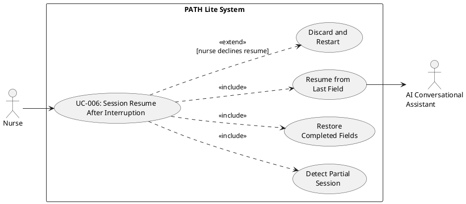

# Requirements Specification

## Feature Goal

Build an AI-driven mobile conversational data entry system (PATH Lite) that enables nurses to capture patient demographic, admission, and treatment details through voice-based interaction on iOS and Android tablets. The system must replace manual form-based data entry with an intelligent conversational assistant that guides nurses through sequential questions, validates responses in real-time, enforces mandatory field completion, handles clarifications, manages session continuity, and provides confirmation screens before final submission.

**Current State**: Nurses manually enter patient data through structured forms on tablets, navigating multiple screens with no voice assistance, basic validation only, and high cognitive load leading to incomplete documentation and workflow friction.

**Desired State**: Nurses interact with an AI conversational assistant that asks sequential questions, converts speech to validated structured data, prevents mandatory field skipping, handles clarifications intelligently, saves partial sessions, resumes from interruption points, and provides confirmation screens with edit capabilities before submission.

## Business Justification

- **Operational Efficiency**: Reduces documentation time by eliminating manual navigation across multiple form screens and enabling hands-free data entry during patient care activities
- **Data Quality Improvement**: Enforces mandatory field completion through AI-guided workflows, reducing incomplete documentation from 15-20% to near-zero through intelligent validation and retry mechanisms
- **Nurse Productivity**: Decreases cognitive load by converting complex form navigation into natural conversational flow, allowing nurses to focus on patient care rather than system navigation
- **Error Reduction**: Real-time validation engine with schema, data type, regex, and format checks prevents data entry errors at the point of capture rather than downstream correction
- **Workflow Integration**: Seamlessly integrates into existing PATH Lite workflow without disrupting hospital operations, maintaining compatibility with current authentication, hospital selection, and patient management processes
- **User Experience**: Natural language interaction reduces training time for new nurses and improves adoption rates compared to traditional form-based interfaces
- **Session Continuity**: Partial session saving and resume capability prevents data loss during interruptions (emergency calls, patient needs), improving completion rates
- **Audit Compliance**: Built-in audit logging ensures regulatory compliance for healthcare data entry and modification tracking

## Feature Scope

### In Scope

**Mobile Application (iOS & Android)**
- Cross-platform React Native application with microphone integration
- Offline cache for partial session persistence
- Local state management for real-time data handling
- Responsive UI for tablet devices

**Authentication & Hospital Management**
- Secure nurse authentication (mock implementation for Phase 1)
- Searchable hospital selection interface
- Hospital-specific patient dashboard

**Patient Management**
- Patient recall search with MRN-mandatory enforcement
- Existing patient list display (Active/Completed status)
- Add New patient workflow for Hemodialysis treatment

**AI Conversational Assistant**
- Voice-activated AI assistant with visual indicator
- Sequential question flow based on form schema
- Speech-to-text conversion engine
- Natural language understanding for clarification detection
- Context-aware question rephrasing
- Multi-attempt retry mechanism with timeout handling

**Data Validation Engine**
- Schema validation (field existence verification)
- Data type validation (String, Integer, Date, Enum, Boolean)
- Regex pattern validation (MRN numeric, phone format, ID patterns)
- Email format validation (RFC-compliant)
- Mandatory field enforcement with submission blocking
- Optional field null handling with default values

**Session Management**
- Partial data persistence on interruption
- Last unanswered field index tracking
- Resume from interruption point (not restart)
- Auto-close after 3 failed response attempts
- Session state maintenance across app lifecycle

**Confirmation & Editing**
- Structured summary page after mandatory field completion
- Manual edit capability with re-validation
- Field-level edit mode
- Save only after explicit confirmation

**Patient Details Form Coverage**
- Section 1: Demographics & Admission (MRN, Name, DOB, Gender, Location, Room)
- Section 2: Clinical Intake (HBsAg, HBsAb with dates and sources)

**Backend Services**
- RESTful API (FastAPI)
- AI Orchestration Service (Azure OpenAI API gpt-4o-mini)
- Rule-based validation engine
- Session management service
- Audit logging service

### Out of Scope (Phase 1)

- Production EHR system integration
- Full PATH Lite system replacement
- Live hospital system connectivity
- Non-Hemodialysis treatment workflows
- Multi-language support
- Offline AI processing (requires internet connectivity)
- Advanced analytics and reporting
- Patient portal integration
- Nurse scheduling integration

### Success Criteria

- [ ] Nurses can authenticate and select hospitals within 30 seconds
- [ ] Patient recall search returns results in under 2 seconds with MRN validation
- [ ] AI conversational flow completes full patient intake in under 5 minutes (vs 8-10 minutes manual)
- [ ] Speech-to-text accuracy exceeds 95% for medical terminology
- [ ] Mandatory field enforcement achieves 100% completion rate before submission
- [ ] Clarification detection accuracy exceeds 90% for common phrases ("repeat", "what do you mean")
- [ ] Session resume functionality restores exact field position in 100% of interruption cases
- [ ] Validation engine catches 100% of schema, type, and format violations before field acceptance
- [ ] System handles no-response scenarios with 3-retry protocol in 100% of timeout cases
- [ ] Confirmation screen displays all entered data with edit capability before final save
- [ ] Audit logs capture 100% of data entry, modification, and session events with timestamps
- [ ] Application maintains offline capability for partial session storage with sync on reconnection

## Functional Requirements

### Authentication & Authorization

- FR-001: [DETERMINISTIC] System MUST provide secure login interface accepting nurse credentials (username and password)
- FR-002: [DETERMINISTIC] System MUST authenticate credentials against mock authentication service (no database for Phase 1)
- FR-003: [DETERMINISTIC] System MUST redirect authenticated nurses to Hospital Selection screen upon successful login
- FR-004: [DETERMINISTIC] System MUST display error message for invalid credentials and allow retry without lockout (Phase 1)
- FR-005: [DETERMINISTIC] System MUST maintain session state across app lifecycle until explicit logout

### Hospital Selection & Patient Dashboard

- FR-006: [DETERMINISTIC] System MUST display searchable hospital list after successful authentication
- FR-007: [DETERMINISTIC] System MUST filter hospital list in real-time as nurse types search query
- FR-008: [DETERMINISTIC] System MUST redirect to Patient Dashboard after hospital selection
- FR-009: [DETERMINISTIC] System MUST display all patients for selected hospital with Active/Completed status indicators
- FR-010: [DETERMINISTIC] System MUST provide "Add New" button to initiate new patient entry workflow
- FR-011: [DETERMINISTIC] System MUST display Hemodialysis as the only treatment option when "Add New" is selected (Phase 1 scope)

### Patient Recall Search

- FR-012: [DETERMINISTIC] System MUST display Patient Recall Search popup when Hemodialysis treatment is selected
- FR-013: [DETERMINISTIC] System MUST provide input fields for: Patient First Name, Patient Last Name, Medical Record Number (MRN), Date of Birth (DOB), Admission/Encounter Number
- FR-014: [DETERMINISTIC] System MUST enforce MRN as mandatory field for search execution
- FR-015: [DETERMINISTIC] System MUST require minimum two fields including MRN before enabling Search button
- FR-016: [DETERMINISTIC] System MUST validate MRN format as numeric-only before search execution
- FR-017: [DETERMINISTIC] System MUST execute patient search against mock patient database when Search button is clicked
- FR-018: [DETERMINISTIC] System MUST redirect to treatment page with prefilled patient data if patient exists
- FR-019: [DETERMINISTIC] System MUST redirect to treatment page for new patient entry if patient does not exist
- FR-020: [DETERMINISTIC] System MUST display required forms list on treatment page for existing patients

### AI Conversational Assistant - Core Functionality

- FR-021: [AI-CANDIDATE] System MUST display AI Voice Icon on treatment page to activate conversational mode
- FR-022: [AI-CANDIDATE] System MUST initiate sequential question flow when AI Voice Icon is activated
- FR-023: [AI-CANDIDATE] System MUST ask structured questions based on Patient Details Form schema in predefined sequence
- FR-024: [AI-CANDIDATE] System MUST capture nurse voice response via device microphone
- FR-025: [AI-CANDIDATE] System MUST convert speech to text using speech-to-text engine with medical terminology support
- FR-026: [HYBRID] System MUST display transcribed text to nurse for visual confirmation before validation
- FR-027: [AI-CANDIDATE] System MUST validate transcribed text against field-specific validation rules
- FR-028: [DETERMINISTIC] System MUST map validated response to corresponding form field in Patient Details Form
- FR-029: [AI-CANDIDATE] System MUST trigger next sequential question after successful field mapping
- FR-030: [DETERMINISTIC] System MUST prevent question skipping for mandatory fields until valid input is provided

### AI Conversational Assistant - Validation Engine

- FR-031: [DETERMINISTIC] System MUST perform schema validation to ensure field exists in Patient Details Form schema
- FR-032: [DETERMINISTIC] System MUST perform data type validation for: String, Integer, Date, Enum, Boolean
- FR-033: [DETERMINISTIC] System MUST perform regex validation for: MRN (numeric only), Phone (pattern check), ID (format check)
- FR-034: [DETERMINISTIC] System MUST perform email format validation using RFC-compliant rules
- FR-035: [DETERMINISTIC] System MUST reject invalid responses and request corrected input via AI re-question
- FR-036: [DETERMINISTIC] System MUST validate enum fields against predefined value lists (e.g., Gender: Male/Female, Treatment Location: OR/Bedside/ICU/CCU/ER/Multi-Tx Room)
- FR-037: [DETERMINISTIC] System MUST validate date fields for format (MM/DD/YYYY) and logical constraints (DOB cannot be future date)
- FR-038: [DETERMINISTIC] System MUST validate mandatory field completeness before allowing progression to next field

### AI Conversational Assistant - Clarification Handling

- FR-039: [AI-CANDIDATE] System MUST detect clarification intent when nurse says: "Repeat", "What do you mean?", "I don't understand", or similar phrases
- FR-040: [AI-CANDIDATE] System MUST rephrase or repeat current question when clarification intent is detected
- FR-041: [DETERMINISTIC] System MUST maintain same field context during clarification without progressing to next field
- FR-042: [AI-CANDIDATE] System MUST provide alternative question phrasing if nurse requests clarification multiple times for same field
- FR-043: [AI-CANDIDATE] System MUST provide field-specific examples when nurse requests clarification (e.g., "MRN is a 4-6 digit number like 5000")

### AI Conversational Assistant - No-Response Handling

- FR-044: [DETERMINISTIC] System MUST wait 5 seconds after asking question before detecting no-response condition
- FR-045: [DETERMINISTIC] System MUST repeat current question if no response is detected within 5 seconds
- FR-046: [DETERMINISTIC] System MUST retry question up to 3 times with 5-second intervals between retries
- FR-047: [DETERMINISTIC] System MUST auto-close AI session after 3 failed response attempts
- FR-048: [DETERMINISTIC] System MUST save partial data to local storage when AI session auto-closes
- FR-049: [DETERMINISTIC] System MUST display notification to nurse indicating session closure reason (no response detected)
- FR-050: [DETERMINISTIC] System MUST store last unanswered field index when session auto-closes

### Session Continuity & Resume

- FR-051: [DETERMINISTIC] System MUST save partial session data to local storage on AI session interruption (auto-close, manual close, app background)
- FR-052: [DETERMINISTIC] System MUST store last unanswered field index with partial session data
- FR-053: [DETERMINISTIC] System MUST maintain session state including: patient identifier, hospital context, completed field values, field index position
- FR-054: [DETERMINISTIC] System MUST detect existing partial session when nurse reopens treatment page for same patient
- FR-055: [DETERMINISTIC] System MUST resume AI conversation from first unanswered question (not restart from beginning)
- FR-056: [DETERMINISTIC] System MUST restore all previously answered field values when resuming session
- FR-057: [DETERMINISTIC] System MUST allow nurse to review previously entered data before resuming AI conversation
- FR-058: [DETERMINISTIC] System MUST clear partial session data after successful submission or explicit nurse cancellation

### Patient Details Form - Demographics & Admission

- FR-059: [DETERMINISTIC] System MUST collect MRN as required field with numeric-only validation
- FR-060: [DETERMINISTIC] System MUST collect Patient First Name as required field with alphabetic validation
- FR-061: [DETERMINISTIC] System MUST collect Patient Middle Initial/Name as optional field with alphabetic validation
- FR-062: [DETERMINISTIC] System MUST collect Patient Last Name as required field with alphabetic validation
- FR-063: [DETERMINISTIC] System MUST collect Date of Birth (DOB) as required field with date format validation (MM/DD/YYYY) and logical constraint (cannot be future date)
- FR-064: [DETERMINISTIC] System MUST collect Admission/Encounter Number as optional field with alphanumeric validation
- FR-065: [DETERMINISTIC] System MUST collect Gender as required field with enum validation (Male, Female)
- FR-066: [DETERMINISTIC] System MUST collect Treatment Location as required field with enum validation (OR, Bedside, ICU/CCU, ER, Multi-Tx Room)
- FR-067: [DETERMINISTIC] System MUST collect Room Number as required field with alphanumeric validation

### Patient Details Form - Clinical Intake

- FR-068: [DETERMINISTIC] System MUST collect HBsAg status as required field with enum validation (Positive, Negative, Unknown)
- FR-069: [DETERMINISTIC] System MUST collect HBsAg Date Drawn as optional field with date format validation (MM/DD/YYYY)
- FR-070: [DETERMINISTIC] System MUST collect HBsAg Source as optional field with enum validation (Hospital, Davita Patient Portal, Non-Davita Source)
- FR-071: [DETERMINISTIC] System MUST collect HBsAb Immune Value as required field with numeric validation
- FR-072: [DETERMINISTIC] System MUST collect HBsAb Date Drawn as optional field with date format validation (MM/DD/YYYY)
- FR-073: [DETERMINISTIC] System MUST collect HBsAb Source as optional field with enum validation (Hospital, Davita Patient Portal, Non-Davita Source)

### Confirmation & Edit Screen

- FR-074: [DETERMINISTIC] System MUST display structured summary page after all mandatory fields are completed
- FR-075: [DETERMINISTIC] System MUST organize summary page by sections: Demographics & Admission, Clinical Intake
- FR-076: [DETERMINISTIC] System MUST display field labels and corresponding values in read-only format on summary page
- FR-077: [DETERMINISTIC] System MUST provide Edit button for each field on summary page
- FR-078: [DETERMINISTIC] System MUST enable inline editing when Edit button is clicked for specific field
- FR-079: [DETERMINISTIC] System MUST re-validate edited field value using same validation rules as initial entry
- FR-080: [DETERMINISTIC] System MUST reject invalid edits and display field-specific error message
- FR-081: [DETERMINISTIC] System MUST update summary page with validated edited value
- FR-082: [DETERMINISTIC] System MUST provide Confirm button to finalize and submit patient data
- FR-083: [DETERMINISTIC] System MUST block submission if any mandatory field is empty or invalid after editing
- FR-084: [DETERMINISTIC] System MUST provide Cancel button to discard all changes and return to patient dashboard

### Data Persistence & Audit

- FR-085: [DETERMINISTIC] System MUST save confirmed patient data to local storage after Confirm button is clicked
- FR-086: [DETERMINISTIC] System MUST generate unique session identifier for each patient entry session
- FR-087: [DETERMINISTIC] System MUST log audit trail for: session start, field completion, validation failures, edits, session interruption, session resume, final submission
- FR-088: [DETERMINISTIC] System MUST capture timestamp, nurse identifier, patient identifier, field name, old value, new value for each audit event
- FR-089: [DETERMINISTIC] System MUST store audit logs in local storage with sync capability for future backend integration
- FR-090: [DETERMINISTIC] System MUST maintain data integrity during offline mode with conflict resolution on reconnection

### Optional Field Handling

- FR-091: [DETERMINISTIC] System MUST allow skipping optional fields when nurse explicitly indicates "skip", "none", or "not applicable"
- FR-092: [DETERMINISTIC] System MUST store NULL value for skipped optional fields
- FR-093: [DETERMINISTIC] System MUST not block progression to next field when optional field is skipped
- FR-094: [DETERMINISTIC] System MUST display optional fields as empty/null on confirmation screen if skipped
- FR-095: [DETERMINISTIC] System MUST allow editing optional fields on confirmation screen even if initially skipped

### Error Handling & User Feedback

- FR-096: [DETERMINISTIC] System MUST display user-friendly error messages for validation failures without technical jargon
- FR-097: [DETERMINISTIC] System MUST provide specific guidance for correcting validation errors (e.g., "MRN must be numeric only. Please provide numbers like 5000")
- FR-098: [DETERMINISTIC] System MUST display visual indicators (color coding, icons) for field validation status (valid, invalid, pending)
- FR-099: [AI-CANDIDATE] System MUST provide conversational error feedback via AI voice (e.g., "I didn't catch that. Could you please repeat the Medical Record Number?")
- FR-100: [DETERMINISTIC] System MUST log all errors to local error log for troubleshooting and analytics

**AI Triage Summary**: 
- **AI-CANDIDATE**: 15 requirements (FR-021 to FR-025, FR-029, FR-039 to FR-043, FR-099)
- **DETERMINISTIC**: 83 requirements (All authentication, validation, data handling, session management)
- **HYBRID**: 1 requirement (FR-026 - visual confirmation of transcribed text)
- **Total**: 100 functional requirements

## Use Case Analysis

### Actors & System Boundary

- **Primary Actor - Nurse**: Healthcare professional responsible for patient data entry during hemodialysis treatment. Interacts with mobile application to capture patient demographics, admission details, and clinical intake information through voice-based conversational interface. Has authority to create, edit, and submit patient records.

- **Secondary Actor - AI Conversational Assistant**: Azure OpenAI-powered intelligent agent that guides nurses through sequential data entry questions, validates responses, handles clarifications, manages retry logic, and maintains conversation context. Operates within system boundary as orchestrated service.

- **System Actor - Authentication Service**: Mock authentication system (Phase 1) that validates nurse credentials and manages session tokens. External to core data entry workflow but required for system access.

- **System Actor - Patient Database**: Mock patient repository (Phase 1) that stores and retrieves patient records for recall search functionality. Provides patient existence verification and prefill data for existing patients.

- **System Actor - Speech-to-Text Engine**: External service that converts nurse voice input to text transcription. Provides medical terminology support and real-time transcription capabilities.

- **System Actor - Audit Logging Service**: System component that captures all data entry events, modifications, and session activities with timestamps for compliance and troubleshooting.

### Use Case Specifications

#### UC-001: Nurse Authentication

- **Actor(s)**: Nurse (Primary), Authentication Service (System)
- **Goal**: Securely authenticate nurse and grant access to hospital selection
- **Preconditions**: 
  - Mobile application is installed and launched
  - Network connectivity is available (Phase 1 mock service)
- **Success Scenario**: 
  1. Nurse launches PATH Lite mobile application
  2. System displays login screen with username and password fields
  3. Nurse enters credentials (username and password)
  4. Nurse clicks Login button
  5. System validates credentials against mock authentication service
  6. System creates session token and stores in local storage
  7. System redirects nurse to Hospital Selection screen
- **Extensions/Alternatives**:
  - 5a. Invalid credentials provided
    - 5a1. System displays error message "Invalid username or password"
    - 5a2. System clears password field and maintains username
    - 5a3. Nurse corrects credentials and retries (no lockout in Phase 1)
  - 5b. Network connectivity lost during authentication
    - 5b1. System displays error message "Unable to connect. Please check network"
    - 5b2. System allows retry when connectivity is restored
- **Postconditions**: 
  - Nurse is authenticated with valid session token
  - Hospital Selection screen is displayed
  - Session state is maintained until explicit logout

##### Use Case Diagram

#### UC-002: Hospital Selection

- **Actor(s)**: Nurse (Primary)
- **Goal**: Select hospital context for patient management
- **Preconditions**: 
  - Nurse is authenticated with valid session
  - Hospital list is available in system
- **Success Scenario**: 
  1. System displays searchable hospital list after authentication
  2. Nurse views list of available hospitals
  3. Nurse types hospital name in search field (optional)
  4. System filters hospital list in real-time based on search query
  5. Nurse selects target hospital from filtered list
  6. System stores hospital context in session
  7. System redirects to Patient Dashboard for selected hospital
- **Extensions/Alternatives**:
  - 3a. Nurse scrolls through full hospital list without search
    - 3a1. Nurse selects hospital directly from unfiltered list
  - 4a. No hospitals match search query
    - 4a1. System displays "No hospitals found" message
    - 4a2. Nurse clears search and tries different query
- **Postconditions**: 
  - Hospital context is set for current session
  - Patient Dashboard displays patients for selected hospital
  - Hospital name is displayed in application header

##### Use Case Diagram

#### UC-003: Patient Recall Search

- **Actor(s)**: Nurse (Primary), Patient Database (System)
- **Goal**: Search for existing patient or initiate new patient entry
- **Preconditions**: 
  - Nurse has selected hospital context
  - Nurse has clicked "Add New" and selected "Hemodialysis" treatment
- **Success Scenario**: 
  1. System displays Patient Recall Search popup
  2. Nurse views search fields: First Name, Last Name, MRN, DOB, Admission/Encounter Number
  3. Nurse enters MRN (mandatory field)
  4. Nurse enters at least one additional field (First Name, Last Name, DOB, or Admission Number)
  5. System validates MRN format (numeric only)
  6. System enables Search button (minimum two fields including MRN)
  7. Nurse clicks Search button
  8. System queries Patient Database with provided criteria
  9. System finds matching patient record
  10. System retrieves patient details and required forms list
  11. System redirects to Treatment Page with prefilled patient data
  12. System displays required forms list for existing patient
- **Extensions/Alternatives**:
  - 4a. Nurse enters only MRN without second field
    - 4a1. System keeps Search button disabled
    - 4a2. System displays hint "Enter at least one more field to search"
  - 5a. MRN contains non-numeric characters
    - 5a1. System displays validation error "MRN must be numeric only"
    - 5a2. System highlights MRN field in red
    - 5a3. Nurse corrects MRN format
  - 9a. No matching patient found
    - 9a1. System displays "Patient not found" message
    - 9a2. System asks "Would you like to add new patient?"
    - 9a3. Nurse confirms new patient entry
    - 9a4. System redirects to Treatment Page for new patient entry (empty form)
  - 9b. Multiple patients match search criteria
    - 9b1. System displays list of matching patients with key identifiers
    - 9b2. Nurse selects correct patient from list
    - 9b3. System proceeds with selected patient data
- **Postconditions**: 
  - Patient context is established (existing or new)
  - Treatment Page is displayed with appropriate data state
  - For existing patients: form fields are prefilled with retrieved data
  - For new patients: form fields are empty and ready for AI entry

##### Use Case Diagram

#### UC-004: AI-Driven Voice Data Entry

- **Actor(s)**: Nurse (Primary), AI Conversational Assistant (Secondary), Speech-to-Text Engine (System)
- **Goal**: Complete patient details form through voice-based conversational interaction
- **Preconditions**: 
  - Patient context is established (existing or new patient)
  - Treatment Page is displayed
  - Device microphone permissions are granted
  - Network connectivity is available for AI service
- **Success Scenario**: 
  1. Nurse clicks AI Voice Icon on Treatment Page
  2. System activates AI Conversational Assistant
  3. AI asks first question: "Please provide Medical Record Number"
  4. Nurse speaks response: "5000"
  5. System captures voice input via microphone
  6. System sends audio to Speech-to-Text Engine
  7. Speech-to-Text Engine returns transcription: "5000"
  8. System displays transcribed text to nurse for visual confirmation
  9. System validates transcription against MRN validation rules (numeric only)
  10. System maps validated value to MRN field in form
  11. System updates form field with value "5000"
  12. AI asks next question: "Please provide Patient First Name"
  13. Nurse speaks response: "John"
  14. System repeats steps 5-11 for First Name field
  15. AI continues sequential questioning through all mandatory fields
  16. System completes all mandatory fields (MRN, First Name, Last Name, DOB, Gender, Treatment Location, Room Number, HBsAg, HBsAb)
  17. System displays Confirmation Screen with all entered data
- **Extensions/Alternatives**:
  - 9a. Validation fails (e.g., non-numeric MRN)
    - 9a1. System rejects transcription
    - 9a2. AI says "MRN must be numeric only. Please provide numbers like 5000"
    - 9a3. System returns to step 4 for same field
  - 13a. Nurse says "Repeat" or "What do you mean?"
    - 13a1. System detects clarification intent
    - 13a2. AI rephrases question: "What is the patient's first name? For example, John or Mary"
    - 13a3. System maintains same field context
    - 13a4. Nurse provides response
  - 13b. No response detected for 5 seconds
    - 13b1. AI repeats question: "Please provide Patient First Name"
    - 13b2. System waits another 5 seconds
    - 13b3. If still no response, retry up to 3 times total
    - 13b4. After 3 failed attempts, system auto-closes AI session
    - 13b5. System saves partial data with last field index
    - 13b6. System displays notification "Session closed due to no response"
  - 15a. Nurse asks to skip optional field (e.g., Middle Name)
    - 15a1. Nurse says "Skip" or "None"
    - 15a2. System stores NULL for optional field
    - 15a3. AI proceeds to next field
  - 16a. Nurse closes app before completing all fields
    - 16a1. System saves partial session data to local storage
    - 16a2. System stores last unanswered field index
    - 16a3. When nurse reopens Treatment Page, system detects partial session
    - 16a4. System asks "Would you like to resume previous session?"
    - 16a5. Nurse confirms resume
    - 16a6. System restores all completed field values
    - 16a7. AI resumes from first unanswered question
- **Postconditions**: 
  - All mandatory fields are completed with validated data
  - Optional fields are either filled or marked as NULL
  - Confirmation Screen is displayed for nurse review
  - Session data is saved for resume capability
  - Audit log captures all field entries and validations

##### Use Case Diagram

#### UC-005: Confirmation and Data Submission

- **Actor(s)**: Nurse (Primary), Audit Logging Service (System)
- **Goal**: Review, edit if necessary, and submit completed patient data
- **Preconditions**: 
  - All mandatory fields are completed via AI voice entry
  - Confirmation Screen is displayed
- **Success Scenario**: 
  1. System displays Confirmation Screen with structured summary
  2. System organizes data by sections: Demographics & Admission, Clinical Intake
  3. Nurse reviews all entered field values
  4. Nurse verifies data accuracy
  5. Nurse clicks Confirm button
  6. System validates all mandatory fields are present and valid
  7. System generates unique session identifier
  8. System saves patient data to local storage
  9. System logs submission event to Audit Logging Service
  10. System displays success message "Patient data saved successfully"
  11. System redirects to Patient Dashboard
  12. System displays newly added patient in patient list
- **Extensions/Alternatives**:
  - 4a. Nurse identifies incorrect data in field
    - 4a1. Nurse clicks Edit button for specific field
    - 4a2. System enables inline editing for selected field
    - 4a3. Nurse modifies field value
    - 4a4. System re-validates edited value using same validation rules
    - 4a5. If validation passes, system updates field value
    - 4a6. If validation fails, system displays error message and rejects edit
    - 4a7. Nurse corrects value until validation passes
    - 4a8. System updates Confirmation Screen with new value
    - 4a9. System logs edit event to Audit Logging Service
  - 4b. Nurse wants to add value to previously skipped optional field
    - 4b1. Nurse clicks Edit button for optional field showing NULL
    - 4b2. System enables inline editing
    - 4b3. Nurse enters value
    - 4b4. System validates and updates field
  - 5a. Nurse decides to cancel submission
    - 5a1. Nurse clicks Cancel button
    - 5a2. System asks "Are you sure you want to discard changes?"
    - 5a3. Nurse confirms cancellation
    - 5a4. System discards all entered data
    - 5a5. System clears partial session storage
    - 5a6. System redirects to Patient Dashboard
  - 6a. Validation detects missing mandatory field (edge case)
    - 6a1. System displays error "Cannot submit. Missing required field: [Field Name]"
    - 6a2. System highlights missing field in red
    - 6a3. Nurse clicks Edit to provide missing value
- **Postconditions**: 
  - Patient data is persisted in local storage
  - Audit trail is complete with submission timestamp
  - Patient appears in Patient Dashboard list
  - Partial session data is cleared
  - Nurse can initiate new patient entry or select different patient

##### Use Case Diagram

#### UC-006: Session Resume After Interruption

- **Actor(s)**: Nurse (Primary), AI Conversational Assistant (Secondary)
- **Goal**: Resume incomplete patient data entry session from interruption point
- **Preconditions**: 
  - Partial session data exists in local storage
  - Nurse reopens Treatment Page for same patient
  - Last unanswered field index is stored
- **Success Scenario**: 
  1. Nurse navigates to Treatment Page for patient with partial session
  2. System detects existing partial session data
  3. System displays prompt "You have an incomplete session. Would you like to resume?"
  4. Nurse clicks Resume button
  5. System retrieves partial session data from local storage
  6. System restores all previously completed field values to form
  7. System retrieves last unanswered field index
  8. System displays summary of completed fields to nurse
  9. Nurse clicks AI Voice Icon to continue
  10. AI resumes questioning from first unanswered field (not from beginning)
  11. Nurse completes remaining mandatory fields via voice interaction
  12. System proceeds to Confirmation Screen after all fields are completed
- **Extensions/Alternatives**:
  - 4a. Nurse declines resume
    - 4a1. Nurse clicks "Start New Session" button
    - 4a2. System asks "This will discard previous data. Are you sure?"
    - 4a3. Nurse confirms discard
    - 4a4. System clears partial session data
    - 4a5. System initializes empty form
    - 4a6. AI starts from first question
  - 5a. Partial session data is corrupted or invalid
    - 5a1. System detects data integrity issue
    - 5a2. System displays error "Unable to resume session. Starting new session"
    - 5a3. System clears corrupted data
    - 5a4. System initializes empty form
  - 8a. Nurse wants to review and edit previously entered data
    - 8a1. Nurse reviews completed field summary
    - 8a2. Nurse clicks Edit for specific field
    - 8a3. System enables inline editing
    - 8a4. Nurse modifies value
    - 8a5. System re-validates and updates field
    - 8a6. Nurse continues with AI voice entry for remaining fields
- **Postconditions**: 
  - All previously completed fields are restored
  - AI conversation continues from correct field position
  - No data loss from interruption
  - Session continuity is maintained
  - Audit log captures resume event

##### Use Case Diagram

## Risks & Mitigations

### R-001: Speech Recognition Accuracy for Medical Terminology
**Risk**: Speech-to-text engine may misinterpret medical terminology, patient names with diverse phonetics, or responses in noisy clinical environments, leading to incorrect data capture and requiring multiple retry attempts.

**Impact**: High - Incorrect transcriptions could result in patient safety issues, data quality degradation, and nurse frustration with the AI assistant.

**Mitigation**:
- Implement medical terminology dictionary in speech-to-text engine configuration
- Display transcribed text visually for nurse confirmation before validation (FR-026)
- Provide edit capability on Confirmation Screen to correct any misinterpreted values (FR-078)
- Train AI model with healthcare-specific voice samples and clinical environment noise profiles
- Implement confidence scoring threshold (>85%) for transcriptions with low-confidence flagging for nurse review

### R-002: Network Dependency for AI Services
**Risk**: AI Conversational Assistant and Speech-to-Text Engine require internet connectivity. Network interruptions in hospital environments could disrupt voice data entry sessions mid-workflow.

**Impact**: Medium - Session interruptions could frustrate nurses and reduce adoption rates, though partial session saving (FR-051) mitigates data loss.

**Mitigation**:
- Implement robust session continuity with partial data persistence (FR-051 to FR-058)
- Provide clear network status indicators in UI
- Enable graceful degradation to manual form entry if network is unavailable
- Implement retry logic with exponential backoff for transient network failures
- Cache AI question sequences locally to reduce real-time API dependency

### R-003: Mandatory Field Enforcement Blocking Workflow
**Risk**: Strict mandatory field enforcement (FR-030, FR-038) could block nurses from progressing if required information is temporarily unavailable (e.g., lab results pending), creating workflow bottlenecks.

**Impact**: Medium - Nurses may abandon sessions or enter placeholder data to bypass validation, compromising data quality.

**Mitigation**:
- Implement "Save as Draft" functionality allowing partial submission with mandatory field warnings
- Provide "Mark for Follow-up" option for fields with pending information
- Enable supervisor override capability for exceptional cases (future enhancement)
- Design validation rules to distinguish between "required for submission" vs "required for workflow progression"
- Implement field-level timestamps to track when pending data was last attempted

### R-004: Session State Synchronization Across Devices
**Risk**: Nurses may switch between multiple tablets during shift. Partial session data stored in local storage (FR-051) may not be accessible from different devices, causing data loss or duplicate entry.

**Impact**: Medium - Workflow disruption and potential data inconsistency if nurse starts new session on different device.

**Mitigation**:
- Implement cloud-based session state synchronization (future enhancement beyond Phase 1)
- Provide session transfer capability via QR code or session ID for device switching
- Display clear warnings when partial session exists on different device
- Implement conflict resolution logic for concurrent sessions on multiple devices
- Log device identifiers in audit trail to track session device history

### R-005: AI Clarification Loop Without Exit Strategy
**Risk**: If AI fails to understand nurse response repeatedly, clarification loop (FR-039 to FR-043) could continue indefinitely without resolution path, trapping nurse in single field.

**Impact**: High - Workflow blockage and nurse frustration could lead to system abandonment.

**Mitigation**:
- Implement maximum clarification attempts (3 attempts) before offering manual entry fallback
- Provide "Switch to Manual Entry" button during AI session for problematic fields
- Escalate to alternative question phrasing after 2 failed clarification attempts (FR-042)
- Log repeated clarification failures for AI model improvement
- Implement field-specific fallback strategies (e.g., show dropdown for enum fields after clarification failure)

## Constraints & Assumptions

### C-001: Phase 1 Scope Limitation - Hemodialysis Only
**Constraint**: System supports only Hemodialysis treatment workflow in Phase 1. Other treatment types (peritoneal dialysis, CRRT, etc.) are explicitly out of scope.

**Rationale**: Focused scope enables rapid MVP delivery and validation of AI conversational approach before expanding to additional treatment types. Hemodialysis represents highest volume use case for initial ROI demonstration.

**Impact**: Nurses handling non-Hemodialysis treatments must continue using existing PATH Lite manual forms until Phase 2 expansion.

### C-002: Mock Services for Authentication and Patient Database
**Constraint**: Phase 1 uses mock authentication service and mock patient database without production EHR integration or live hospital system connectivity.

**Rationale**: Decouples AI conversational interface development from complex EHR integration work, enabling parallel development tracks and faster iteration on user experience.

**Impact**: Patient data entered in Phase 1 is not persisted to production systems. Migration strategy required for Phase 2 production integration.

### C-003: Internet Connectivity Required for AI Functionality
**Assumption**: Hospital environments provide reliable WiFi or cellular connectivity for tablet devices to access Azure OpenAI API and Speech-to-Text Engine.

**Rationale**: On-device AI processing for medical-grade conversational AI is not feasible with current mobile hardware constraints. Cloud-based AI services provide superior accuracy and model update flexibility.

**Impact**: AI voice entry is unavailable in network dead zones. Nurses must use manual form entry as fallback. Partial session saving (FR-051) mitigates data loss during connectivity interruptions.

### C-004: Device Microphone Permissions and Quality
**Assumption**: Nurses grant microphone permissions to PATH Lite application, and tablet devices have functional microphones with adequate quality for speech capture in clinical environments.

**Rationale**: Voice-based data entry is core value proposition. Without microphone access, system degrades to manual form entry, eliminating primary benefit.

**Impact**: Onboarding process must include microphone permission education. Device procurement standards must specify minimum microphone quality requirements for clinical noise environments.

### C-005: Nurse Digital Literacy and Voice Interaction Comfort
**Assumption**: Nurses are comfortable with voice-based interaction and can adapt to conversational AI workflow with minimal training (under 30 minutes).

**Rationale**: Target user population (hospital nurses) has increasing familiarity with voice assistants (Siri, Alexa) in personal life. Clinical workflow efficiency gains justify learning curve investment.

**Impact**: Change management and training programs required for successful adoption. User acceptance testing must validate assumption with representative nurse population before full rollout. Fallback to manual entry must remain available for nurses preferring traditional forms.
