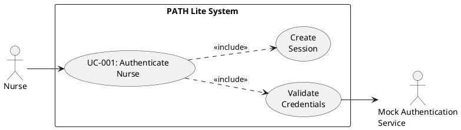
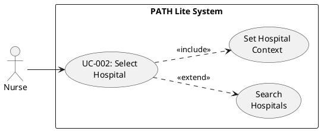
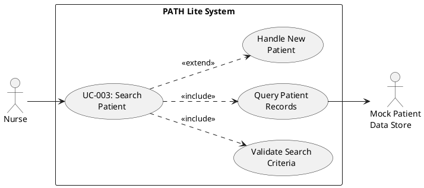
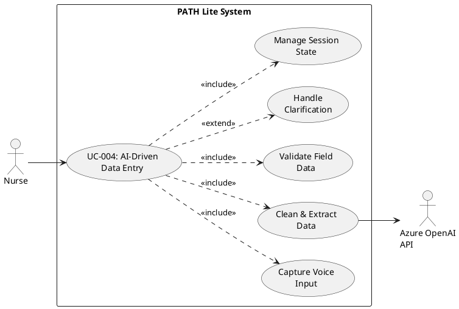
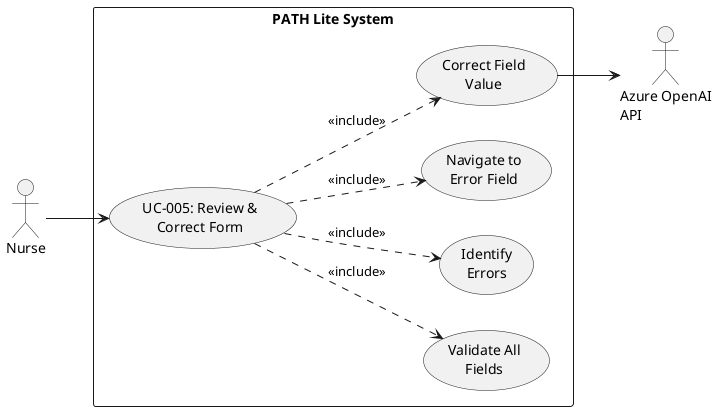
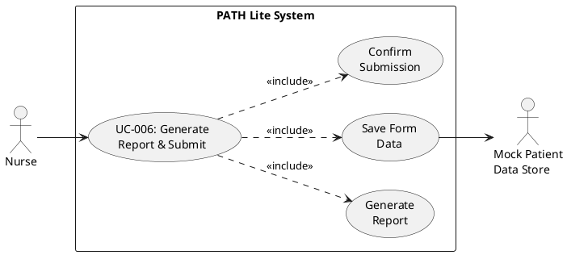
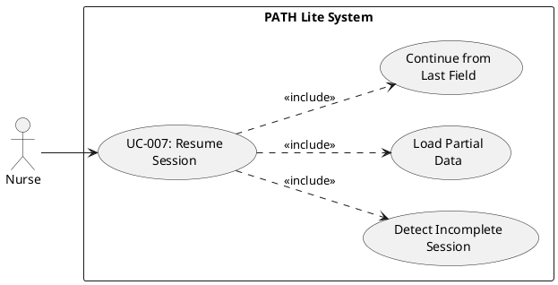

# Requirements Specification

## Feature Goal

Transform the PATH Lite mobile application from manual form-based data entry to an AI-driven conversational interface that enables nurses to complete patient demographic, admission, and treatment documentation through natural voice interaction. The system will guide nurses through sequential questions, validate responses in real-time, handle clarifications intelligently, and maintain session continuity—reducing cognitive load, documentation time, and data entry errors while maintaining strict validation and compliance requirements.

## Business Justification

- **Operational Efficiency**: Reduces time spent on manual data entry by 40-60% through voice-driven workflows, allowing nurses to focus more on patient care
- **Error Reduction**: Eliminates incomplete documentation and reduces data entry errors through mandatory field enforcement and intelligent validation
- **User Experience**: Decreases cognitive load by replacing multi-screen navigation with guided conversational flow
- **Workflow Integration**: Seamlessly integrates into existing PATH Lite workflow without disrupting current hospital processes
- **Scalability Foundation**: Establishes AI infrastructure for future expansion to additional treatment types beyond Hemodialysis
- **Competitive Advantage**: Positions PATH Lite as an innovative, nurse-friendly solution in the healthcare documentation market

## Feature Scope

**Note**: This is a **prototype phase using mock data only (no database)** to validate AI-driven conversational data entry approach before production deployment.

### In Scope
- Cross-platform mobile application (iOS & Android) with responsive design for 7-12.9 inch tablets
- Secure nurse authentication and hospital selection workflow using hardcoded mock credentials and mock hospital list (no database)
- Patient recall search with MRN-based validation using hardcoded mock patient data (no database)
- AI-powered conversational data entry for Hemodialysis treatment workflow with mock form submissions stored in local MMKV storage
- Voice interaction using Text-to-Speech (TTS) and Speech-to-Text (STT)
- LLM-based data extraction and cleaning from conversational responses
- Multi-layer validation engine (schema, data type, regex, business rules)
- Natural language clarification handling and retry mechanisms
- Session persistence and resume capability using local MMKV storage for mock data
- AI-driven review and error correction workflow
- Confirmation screen with report generation from mock data
- Audit logging for compliance tracking stored as mock data in local MMKV storage (no database)

### Out of Scope (Phase 1 - Prototype)
- Production deployment
- Production EHR system integration
- Full PATH Lite feature replacement
- Live hospital system connectivity
- Real database integration (all data is mock data stored locally)
- Real patient data (all patient records are hardcoded mock data)
- Non-Hemodialysis treatment types
- Multi-language support
- Offline voice processing (requires internet connectivity for Azure OpenAI)

### Success Criteria
- [ ] Nurse can complete form using voice interaction end-to-end
- [ ] AI correctly maps voice responses to form fields with 95% accuracy
- [ ] Confirmation step works correctly with review and error correction workflow
- [ ] UI works in iPad resolution (7-12.9 inch) in both portrait and landscape
- [ ] Customer approves prototype functionality and user experience
- [ ] Voice interaction latency meets < 2 second requirement
- [ ] All mandatory fields are enforced and prevent submission when incomplete
- [ ] Session resume functionality works correctly after interruptions with zero data loss
- [ ] All validation errors are detected and communicated verbally by AI
- [ ] Nurses can complete patient data entry 50% faster compared to manual form entry

## Functional Requirements

### Authentication & Access Control
- FR-001: [DETERMINISTIC] System MUST provide secure login functionality with username and password authentication
- FR-002: [DETERMINISTIC] System MUST validate credentials against hardcoded mock authentication data (no database) and deny access for invalid credentials
- FR-003: [DETERMINISTIC] System MUST redirect authenticated users to Hospital Selection screen upon successful login
- FR-004: [DETERMINISTIC] System MUST implement session timeout after 30 minutes of inactivity

### Hospital & Patient Management
- FR-005: [DETERMINISTIC] System MUST display searchable list of hospitals for nurse selection
- FR-006: [DETERMINISTIC] System MUST redirect to Patient Dashboard after hospital selection
- FR-007: [DETERMINISTIC] System MUST display all mock patients (Active/Completed) for selected hospital from hardcoded mock data (no database)
- FR-008: [DETERMINISTIC] System MUST provide "Add New" button to initiate new patient entry workflow
- FR-009: [DETERMINISTIC] System MUST display Hemodialysis as treatment type option in Phase 1

### Patient Recall Search
- FR-010: [DETERMINISTIC] System MUST provide Patient Recall Search popup with fields: First Name, Last Name, MRN, DOB, Admission/Encounter Number
- FR-011: [DETERMINISTIC] System MUST enforce MRN as mandatory field for search execution
- FR-012: [DETERMINISTIC] System MUST enable Search button only when minimum two fields are entered including MRN
- FR-013: [DETERMINISTIC] System MUST search hardcoded mock patient records (no database) based on provided criteria
- FR-014: [DETERMINISTIC] System MUST redirect to treatment page with prefilled mock data if mock patient exists in hardcoded list
- FR-015: [DETERMINISTIC] System MUST allow new mock patient creation with MRN and details stored in local MMKV storage (no database)

### AI Conversational Interface
- FR-016: [AI-CANDIDATE] System MUST activate Text-to-Speech (TTS) automatically when form opens
- FR-017: [AI-CANDIDATE] System MUST ask structured questions sequentially using TTS for each form field
- FR-018: [AI-CANDIDATE] System MUST capture nurse voice responses using Speech-to-Text (STT) engine
- FR-019: [AI-CANDIDATE] System MUST process STT output through LLM to extract clean, structured data from conversational responses
- FR-020: [AI-CANDIDATE] System MUST remove filler words, normalize formatting, and extract relevant values using LLM cleaning rules
- FR-021: [DETERMINISTIC] System MUST map cleaned data to corresponding form fields based on question context
- FR-022: [DETERMINISTIC] System MUST trigger next sequential question after successful field population
- FR-023: [HYBRID] System MUST display AI voice icon to activate/deactivate conversational mode with visual feedback

### LLM Data Cleaning & Extraction
- FR-024: [AI-CANDIDATE] System MUST extract only relevant answers from conversational responses (e.g., "Patient name is Chaman" → "Chaman")
- FR-025: [AI-CANDIDATE] System MUST remove filler words: "the", "is", "was", "patient", "name", "uh", "um", "like"
- FR-026: [AI-CANDIDATE] System MUST standardize date formats to MM/DD/YYYY from natural language (e.g., "January 15th, 1980" → "01/15/1980")
- FR-027: [AI-CANDIDATE] System MUST normalize text casing to proper case for name fields
- FR-028: [AI-CANDIDATE] System MUST preserve numeric values exactly as spoken
- FR-029: [AI-CANDIDATE] System MUST remove punctuation except where required (dates, decimals)

### Validation Engine
- FR-030: [DETERMINISTIC] System MUST perform schema validation to ensure field exists in form schema
- FR-031: [DETERMINISTIC] System MUST validate data types: String, Integer, Date, Enum, Boolean
- FR-032: [DETERMINISTIC] System MUST apply regex validation patterns (MRN: numeric only, Phone: pattern check, ID: format check)
- FR-033: [DETERMINISTIC] System MUST validate email fields using RFC-compliant format validation
- FR-034: [DETERMINISTIC] System MUST enforce mandatory field completion before allowing submission
- FR-035: [DETERMINISTIC] System MUST allow optional fields to be skipped and stored as NULL or default value
- FR-036: [HYBRID] System MUST request corrected input via AI voice when validation fails
- FR-037: [DETERMINISTIC] System MUST re-validate field after correction attempt

### Mandatory Field Enforcement
- FR-038: [DETERMINISTIC] System MUST enforce the following mandatory fields: MRN, First Name, Last Name, DOB, Gender, Treatment Location, Room Number, HBsAg, HBsAb
- FR-039: [DETERMINISTIC] System MUST prevent skipping mandatory fields during AI conversation flow
- FR-040: [HYBRID] System MUST re-ask mandatory field questions until valid input is provided
- FR-041: [DETERMINISTIC] System MUST block form submission if any mandatory field is incomplete

### Clarification & Intent Detection
- FR-042: [AI-CANDIDATE] System MUST detect clarification intent when nurse says: "Repeat", "What do you mean?", "I don't understand"
- FR-043: [AI-CANDIDATE] System MUST rephrase or repeat current question when clarification is requested
- FR-044: [DETERMINISTIC] System MUST maintain same field context during clarification exchanges
- FR-045: [AI-CANDIDATE] System MUST continue conversation flow after clarification is resolved

### No-Response Handling
- FR-046: [DETERMINISTIC] System MUST wait 5 seconds after asking question before detecting no-response
- FR-047: [DETERMINISTIC] System MUST repeat question if no response is detected
- FR-048: [DETERMINISTIC] System MUST retry up to 3 times for no-response scenarios
- FR-049: [DETERMINISTIC] System MUST auto-close AI session after 3 failed response attempts
- FR-050: [DETERMINISTIC] System MUST save partial data when session auto-closes
- FR-051: [DETERMINISTIC] System MUST notify nurse of session closure via TTS and visual notification

### Session Continuity & Resume
- FR-052: [DETERMINISTIC] System MUST save partial form data when AI session closes before completion
- FR-053: [DETERMINISTIC] System MUST store last unanswered field index in session state
- FR-054: [DETERMINISTIC] System MUST maintain session state across app interruptions
- FR-055: [DETERMINISTIC] System MUST resume from first unanswered question when session is reopened
- FR-056: [DETERMINISTIC] System MUST NOT restart conversation from beginning on session resume
- FR-057: [DETERMINISTIC] System MUST preserve all previously answered field values during resume

### Confirmation & Edit Screen
- FR-098: [DETERMINISTIC] System MUST display structured summary page after all mandatory fields are filled
- FR-099: [DETERMINISTIC] System MUST redirect user to Review accordion/tab automatically upon form completion
- FR-100: [DETERMINISTIC] System MUST reflect navigation state clearly in left panel showing current Review tab
- FR-101: [DETERMINISTIC] System MUST provide edit option for all displayed fields on summary page
- FR-102: [DETERMINISTIC] System MUST allow manual edits to any field from confirmation screen
- FR-103: [DETERMINISTIC] System MUST re-validate all edited fields before accepting changes
- FR-104: [DETERMINISTIC] System MUST save form data only after explicit confirmation from user
- FR-105: [DETERMINISTIC] System MUST display field labels and values in organized sections on summary page
- FR-106: [DETERMINISTIC] System MUST highlight mandatory vs optional fields on summary page
- FR-107: [DETERMINISTIC] System MUST provide clear visual indication of edit mode vs view mode

### Review & Validation Flow
- FR-058: [DETERMINISTIC] System MUST enable Review button by default when form is populated
- FR-059: [DETERMINISTIC] System MUST disable Continue button until review validation passes
- FR-060: [AI-CANDIDATE] System MUST trigger review validation when nurse says "Please review the form"
- FR-061: [DETERMINISTIC] System MUST perform comprehensive validation: schema, data type, regex, required fields
- FR-062: [DETERMINISTIC] System MUST identify and categorize field-level errors, warnings, and mismatched values
- FR-063: [AI-CANDIDATE] System MUST verbally summarize validation errors with section and field details via TTS
- FR-064: [AI-CANDIDATE] System MUST ask nurse if they want to edit errors after review summary

### Error Correction Workflow
- FR-065: [AI-CANDIDATE] System MUST detect edit intent when nurse responds "Yes, edit" or similar affirmative
- FR-066: [DETERMINISTIC] System MUST navigate to first erroneous field automatically
- FR-067: [DETERMINISTIC] System MUST auto-focus erroneous field for correction
- FR-068: [AI-CANDIDATE] System MUST re-ask only the specific question for erroneous field via TTS
- FR-069: [AI-CANDIDATE] System MUST process corrected voice response through STT → LLM cleaning → validation pipeline
- FR-070: [DETERMINISTIC] System MUST update field with corrected value after successful validation
- FR-071: [DETERMINISTIC] System MUST automatically return to Review screen after all corrections
- FR-072: [DETERMINISTIC] System MUST trigger validation again after corrections are complete

### Validation Success & Submission
- FR-073: [AI-CANDIDATE] System MUST announce "All fields are valid. Do you want to submit?" via TTS when validation passes
- FR-074: [AI-CANDIDATE] System MUST detect submission intent when nurse says "Submit" or similar confirmation
- FR-075: [DETERMINISTIC] System MUST enable Continue button after successful review validation
- FR-076: [AI-CANDIDATE] System MUST ask "Do you want to continue?" via TTS after review completion
- FR-077: [DETERMINISTIC] System MUST display View Report and Submit buttons after Continue action

### Report Generation & Final Submission
- FR-078: [DETERMINISTIC] System MUST generate report based on submitted mock form data
- FR-079: [DETERMINISTIC] System MUST display generated report when View Report button is clicked
- FR-080: [AI-CANDIDATE] System MUST wait for user instruction after displaying report
- FR-081: [AI-CANDIDATE] System MUST detect final submission intent when nurse says "Report looks fine, submit"
- FR-082: [DETERMINISTIC] System MUST save mock form data to local MMKV storage (no database) upon final submission
- FR-083: [DETERMINISTIC] System MUST generate submission confirmation
- FR-084: [AI-CANDIDATE] System MUST announce successful submission via TTS: "Form submitted successfully. Patient record has been saved."

### Form Fields & Data Model
- FR-085: [DETERMINISTIC] System MUST capture Demographics & Admission fields: MRN (Required), First Name (Required), Middle Initial/Name (Optional), Last Name (Required), DOB (Required), Admission/Encounter Number (Optional), Gender (Required: Male/Female), Treatment Location (Required: OR/Bedside/ICU-CCU/ER/Multi-Tx Room), Room Number (Required)
- FR-086: [DETERMINISTIC] System MUST capture Clinical Intake fields: HBsAg (Required: Positive/Negative/Unknown), HBsAg Date Drawn (Optional), HBsAg Source (Optional: Hospital/Davita Patient Portal/Non-Davita Source), HBsAb Immune Value (Required), HBsAb Date Drawn (Optional), HBsAb Source (Optional: Hospital/Davita Patient Portal/Non-Davita Source)

### UI/UX Requirements
- FR-087: [DETERMINISTIC] System MUST be responsive across tablet screen sizes: 7-inch to 12.9-inch
- FR-088: [DETERMINISTIC] System MUST support both portrait and landscape orientations
- FR-089: [DETERMINISTIC] System MUST use primary theme color #1566A7 (Blue) consistently throughout application
- FR-090: [DETERMINISTIC] System MUST implement touch-friendly UI elements with minimum 44x44pt tap targets
- FR-091: [DETERMINISTIC] System MUST maintain clear visual hierarchy and readability in clinical lighting conditions
- FR-092: [DETERMINISTIC] System MUST display AI voice icon with clear visual states (active/inactive/listening)

### Audit & Compliance
- FR-093: [DETERMINISTIC] System MUST log all user actions with timestamp, user ID, and action type in local MMKV storage as mock audit data (no database)
- FR-094: [DETERMINISTIC] System MUST log all data modifications with before/after values in local MMKV storage as mock audit data (no database)
- FR-095: [DETERMINISTIC] System MUST log all validation failures with error details in local MMKV storage as mock audit data (no database)
- FR-096: [DETERMINISTIC] System MUST log all AI interactions including questions asked and responses received in local MMKV storage as mock audit data (no database)
- FR-097: [DETERMINISTIC] System MUST maintain mock audit trail in local MMKV storage for compliance and troubleshooting purposes (no database)

## Non-Functional Requirements

### Performance Requirements
- NFR-001: [DETERMINISTIC] System MUST maintain response latency under 2 seconds for all voice interactions
- NFR-002: [DETERMINISTIC] System MUST complete voice-to-text conversion in under 1 second
- NFR-003: [DETERMINISTIC] System MUST complete AI processing and data extraction in under 1 second
- NFR-004: [DETERMINISTIC] System MUST complete form validation in under 500 milliseconds
- NFR-005: [DETERMINISTIC] System MUST handle concurrent voice input without audio interference

### Usability Requirements
- NFR-006: [DETERMINISTIC] System MUST provide simple conversational interface requiring minimal training
- NFR-007: [DETERMINISTIC] System MUST provide clear audio feedback for all user interactions
- NFR-008: [DETERMINISTIC] System MUST display intuitive error messages with actionable guidance
- NFR-009: [DETERMINISTIC] System MUST support single-handed operation for tablet use
- NFR-010: [DETERMINISTIC] System MUST maintain consistent UI patterns across all screens

### Security Requirements
- NFR-011: [DETERMINISTIC] System MUST implement HIPAA-compliant architecture for patient data protection
- NFR-012: [DETERMINISTIC] System MUST encrypt all data transmission using TLS 1.3 or higher
- NFR-013: [DETERMINISTIC] System MUST implement secure session management with token-based authentication
- NFR-014: [DETERMINISTIC] System MUST maintain comprehensive audit trail for all data access and modifications
- NFR-015: [DETERMINISTIC] System MUST implement role-based access control for user permissions
- NFR-016: [DETERMINISTIC] System MUST sanitize all voice input before processing to prevent injection attacks

### Compatibility Requirements
- NFR-017: [DETERMINISTIC] System MUST be responsive for iPad devices ranging from 7-inch to 12.9-inch screen sizes
- NFR-018: [DETERMINISTIC] System MUST support iOS 14.0 and above
- NFR-019: [DETERMINISTIC] System MUST support Android 10.0 and above
- NFR-020: [DETERMINISTIC] System MUST support both portrait and landscape orientations seamlessly
- NFR-021: [DETERMINISTIC] System MUST work with standard tablet microphones without requiring external hardware

### Scalability Requirements
- NFR-022: [DETERMINISTIC] System MUST support future PATH Full integration through modular architecture
- NFR-023: [DETERMINISTIC] System MUST use extensible architecture to support additional treatment types beyond Hemodialysis
- NFR-024: [DETERMINISTIC] System MUST implement modular design patterns for feature expansion
- NFR-025: [DETERMINISTIC] System MUST support horizontal scaling for increased user load in future phases

### Reliability Requirements
- NFR-026: [DETERMINISTIC] System MUST maintain 99% uptime during business hours (8 AM - 8 PM)
- NFR-027: [DETERMINISTIC] System MUST gracefully handle network interruptions with automatic retry mechanisms
- NFR-028: [DETERMINISTIC] System MUST preserve session state during app backgrounding or interruptions
- NFR-029: [DETERMINISTIC] System MUST provide offline capability for partial data storage when network is unavailable

### Maintainability Requirements
- NFR-030: [DETERMINISTIC] System MUST use standardized coding conventions and documentation
- NFR-031: [DETERMINISTIC] System MUST implement comprehensive error logging for troubleshooting
- NFR-032: [DETERMINISTIC] System MUST support version updates without data loss

## Use Case Analysis

### Actors & System Boundary

- **Primary Actor: Nurse** - Healthcare professional responsible for patient data entry and documentation. Interacts with mobile application to record patient demographics, admission details, and treatment information using voice-driven conversational interface.

- **Secondary Actor: System Administrator** - Manages user accounts, hospital configurations, and system settings. Not directly involved in patient data entry workflow.

- **System Actor: Azure OpenAI API** - External AI service that processes conversational responses, performs LLM-based data cleaning, and extracts structured information from natural language input.

- **System Actor: Mock Authentication Service** - Hardcoded mock service that validates nurse credentials against predefined mock data (no database) and manages session tokens.

- **System Actor: Mock Patient Data Store** - Local MMKV storage that maintains hardcoded sample patient records, treatment history, and form submissions for Phase 1 testing (no database).

### Use Case Specifications

#### UC-001: Nurse Authentication
- **Actor(s)**: Nurse, Mock Authentication Service
- **Goal**: Securely authenticate nurse and grant access to PATH Lite application
- **Preconditions**: 
  - Nurse has valid credentials
  - Application is installed and launched
  - Network connectivity is available
- **Success Scenario**:
  1. Nurse launches PATH Lite mobile application
  2. System displays login screen with username and password fields
  3. Nurse enters credentials
  4. System validates credentials with Mock Authentication Service
  5. Mock Authentication Service confirms valid credentials against hardcoded mock data (no database)
  6. System creates session token
  7. System redirects nurse to Hospital Selection screen
- **Extensions/Alternatives**:
  - 4a. Invalid credentials provided
    - 4a1. System displays error message "Invalid username or password"
    - 4a2. System clears password field
    - 4a3. Return to step 3
  - 4b. Network connectivity lost
    - 4b1. System displays error message "Unable to connect. Please check your network."
    - 4b2. System allows retry
  - 7a. Session timeout occurs (30 minutes inactivity)
    - 7a1. System logs out nurse automatically
    - 7a2. System redirects to login screen
- **Postconditions**: Nurse is authenticated and has active session token

##### Use Case Diagram

#### UC-002: Hospital Selection
- **Actor(s)**: Nurse
- **Goal**: Select hospital context for patient management
- **Preconditions**: 
  - Nurse is authenticated
  - Hospital list is available
- **Success Scenario**:
  1. System displays searchable hospital list
  2. Nurse searches or scrolls through hospital list
  3. Nurse selects target hospital
  4. System sets hospital context for session
  5. System redirects to Patient Dashboard for selected hospital
- **Extensions/Alternatives**:
  - 2a. Nurse uses search functionality
    - 2a1. Nurse enters hospital name or code
    - 2a2. System filters hospital list in real-time
    - 2a3. Continue to step 3
  - 3a. No hospitals available
    - 3a1. System displays "No hospitals found" message
    - 3a2. System prompts nurse to contact administrator
- **Postconditions**: Hospital context is set for current session

##### Use Case Diagram

#### UC-003: Patient Recall Search
- **Actor(s)**: Nurse, Mock Patient Data Store
- **Goal**: Search for existing patient or confirm new patient entry
- **Preconditions**: 
  - Nurse has selected hospital
  - Nurse has clicked "Add New" button
  - Hemodialysis treatment type is selected
- **Success Scenario**:
  1. System displays Patient Recall Search popup
  2. Nurse enters minimum two fields including MRN (mandatory)
  3. System enables Search button
  4. Nurse clicks Search button
  5. System queries hardcoded mock patient list in local storage (no database) with search criteria
  6. Mock Patient Data Store returns matching patient record from hardcoded sample data
  7. System redirects to treatment page with prefilled mock patient data
- **Extensions/Alternatives**:
  - 2a. Nurse enters less than two fields
    - 2a1. System keeps Search button disabled
    - 2a2. Return to step 2
  - 2b. Nurse omits MRN field
    - 2b1. System keeps Search button disabled
    - 2b2. System displays tooltip "MRN is required for search"
    - 2b3. Return to step 2
  - 6a. No matching patient found
    - 6a1. System displays "Patient not found" message
    - 6a2. System prompts "Would you like to add new patient?"
    - 6a3. Nurse confirms new patient creation
    - 6a4. System redirects to treatment page with empty form
  - 6b. Multiple patients match criteria
    - 6b1. System displays list of matching patients
    - 6b2. Nurse selects correct patient
    - 6b3. Continue to step 7
- **Postconditions**: Patient is identified (existing or new) and treatment page is displayed

##### Use Case Diagram

#### UC-004: AI-Driven Patient Data Entry
- **Actor(s)**: Nurse, Azure OpenAI API
- **Goal**: Complete patient demographic and clinical data entry through voice conversation
- **Preconditions**: 
  - Patient is identified (existing or new)
  - Treatment page is displayed
  - Network connectivity is available
  - Microphone permissions are granted
- **Success Scenario**:
  1. System activates AI voice icon and TTS automatically
  2. AI asks first question via TTS: "Please provide Medical Record Number"
  3. Nurse responds via voice
  4. System captures voice using STT engine
  5. System sends STT output to Azure OpenAI API for cleaning
  6. Azure OpenAI API extracts clean data and returns structured value
  7. System validates cleaned data against field rules
  8. System populates MRN field with validated value
  9. System triggers next question
  10. Repeat steps 2-9 for all form fields sequentially
  11. System completes all mandatory and optional fields
  12. System announces completion via TTS
- **Extensions/Alternatives**:
  - 3a. Nurse provides conversational response
    - 3a1. Example: "Patient name is Chaman"
    - 3a2. STT captures: "Patient name is Chaman"
    - 3a3. LLM extracts: "Chaman"
    - 3a4. Continue to step 7
  - 3b. Nurse provides date in natural language
    - 3b1. Example: "The patient was born on January 15th, 1980"
    - 3b2. STT captures full sentence
    - 3b3. LLM converts to: "01/15/1980"
    - 3b4. Continue to step 7
  - 7a. Validation fails
    - 7a1. System identifies validation error (e.g., invalid format)
    - 7a2. AI announces error via TTS: "Invalid format. Please provide MRN as numeric value."
    - 7a3. Return to step 2 (re-ask same question)
  - 3c. Nurse requests clarification
    - 3c1. Nurse says "Repeat" or "What do you mean?"
    - 3c2. System detects clarification intent
    - 3c3. AI rephrases question via TTS
    - 3c4. Return to step 3
  - 3d. No response detected
    - 3d1. System waits 5 seconds
    - 3d2. AI repeats question via TTS
    - 3d3. System retries up to 3 times
    - 3d4. After 3 failures: System auto-closes session, saves partial data
    - 3d5. System notifies nurse of session closure
  - 10a. Nurse interrupts session
    - 10a1. System saves partial data with last unanswered field index
    - 10a2. System maintains session state
    - 10a3. On resume: System starts from first unanswered question
- **Postconditions**: All form fields are populated with validated data

##### Use Case Diagram

#### UC-005: AI-Driven Form Review and Error Correction
- **Actor(s)**: Nurse, Azure OpenAI API
- **Goal**: Validate completed form and correct errors through AI-guided workflow
- **Preconditions**: 
  - All form fields are populated
  - Nurse has requested review (button click or voice command)
- **Success Scenario**:
  1. Nurse says "Please review the form" or clicks Review button
  2. System triggers comprehensive validation (schema, data type, regex, required fields)
  3. System identifies all validation errors and warnings
  4. System categorizes errors by section and field
  5. AI announces summary via TTS: "I found 2 errors. In Demographics section, Date of Birth format is invalid. In Clinical Intake section, HBsAb value is missing. Would you like to edit these fields?"
  6. Nurse responds "Yes, edit"
  7. System navigates to first erroneous field (DOB)
  8. System auto-focuses DOB field
  9. AI asks via TTS: "Let's correct the Date of Birth. What is the patient's date of birth?"
  10. Nurse provides corrected response
  11. System processes through STT → LLM cleaning → validation pipeline
  12. System updates DOB field with corrected value
  13. AI announces: "Date of Birth updated. Moving to next error."
  14. Repeat steps 7-13 for remaining errors
  15. System automatically returns to Review screen
  16. System triggers validation again
  17. All validations pass
  18. AI announces via TTS: "All fields are valid. Do you want to submit?"
  19. System enables Continue button
- **Extensions/Alternatives**:
  - 3a. No errors found
    - 3a1. AI announces: "All fields are valid. Do you want to submit?"
    - 3a2. Skip to step 19
  - 6a. Nurse declines to edit
    - 6a1. Nurse says "No" or "Cancel"
    - 6a2. System remains on review screen
    - 6a3. Continue button remains disabled
  - 11a. Corrected value still fails validation
    - 11a1. System detects validation failure
    - 11a2. AI announces specific error via TTS
    - 11a3. Return to step 9 (re-ask same question)
  - 16a. New errors detected after corrections
    - 16a1. System identifies remaining errors
    - 16a2. Return to step 4
- **Postconditions**: All form fields pass validation and Continue button is enabled

##### Use Case Diagram

#### UC-006: Report Generation and Final Submission
- **Actor(s)**: Nurse, Mock Patient Data Store
- **Goal**: Generate patient report and submit final form data
- **Preconditions**: 
  - All form validations have passed
  - Continue button is enabled
  - Nurse has confirmed continuation
- **Success Scenario**:
  1. AI asks via TTS: "Do you want to continue?"
  2. Nurse responds "Continue"
  3. System enables Continue button
  4. System displays View Report and Submit buttons
  5. Nurse clicks View Report button
  6. System generates report based on form data
  7. System displays generated report
  8. AI announces via TTS: "Report is displayed. Please review and let me know if you want to submit."
  9. Nurse reviews report
  10. Nurse says "Report looks fine, submit"
  11. System detects submission intent
  12. System saves mock form data to local MMKV storage (no database)
  13. Mock Patient Data Store confirms successful save to local MMKV storage
  14. System generates submission confirmation
  15. AI announces via TTS: "Form submitted successfully. Patient record has been saved."
  16. System redirects to Patient Dashboard
- **Extensions/Alternatives**:
  - 10a. Nurse identifies errors in report
    - 10a1. Nurse says "Go back" or "Edit form"
    - 10a2. System returns to form editing mode
    - 10a3. Nurse corrects fields
    - 10a4. Return to UC-005 for review
  - 12a. Local MMKV storage save fails
    - 12a1. System receives error from Mock Patient Data Store
    - 12a2. System displays error message
    - 12a3. System retains mock form data in memory
    - 12a4. System prompts nurse to retry submission
  - 5a. Nurse skips report review
    - 5a1. Nurse clicks Submit button directly
    - 5a2. Continue to step 11
- **Postconditions**: Patient data is saved to local storage and nurse is redirected to dashboard

##### Use Case Diagram

#### UC-007: Session Resume After Interruption
- **Actor(s)**: Nurse
- **Goal**: Resume incomplete data entry session from point of interruption
- **Preconditions**: 
  - Previous AI session was interrupted before completion
  - Partial data was saved with session state
  - Last unanswered field index is stored
- **Success Scenario**:
  1. Nurse reopens treatment page for patient
  2. System detects incomplete session state
  3. System loads partial form data
  4. System identifies last unanswered field index
  5. System displays confirmation: "You have an incomplete session. Would you like to resume?"
  6. Nurse confirms resume
  7. System activates AI voice mode
  8. AI asks question for first unanswered field via TTS
  9. Nurse responds via voice
  10. System continues normal AI-driven data entry flow from interruption point
  11. System completes remaining fields
- **Extensions/Alternatives**:
  - 6a. Nurse declines to resume
    - 6a1. Nurse selects "Start Over"
    - 6a2. System clears partial data
    - 6a3. System starts fresh AI conversation from first field
  - 2a. Session expired (>24 hours old)
    - 2a1. System displays "Session expired. Starting new entry."
    - 2a2. System clears stale session data
    - 2a3. System starts fresh AI conversation
  - 3a. Partial data corrupted
    - 3a1. System detects data integrity issue
    - 3a2. System logs error
    - 3a3. System prompts nurse to start over
- **Postconditions**: Session is resumed from interruption point with all previous data intact

##### Use Case Diagram

## Risks & Mitigations

### R-001: Voice Recognition Accuracy in Noisy Clinical Environments
**Risk**: Background noise in hospitals (alarms, conversations, equipment) may degrade STT accuracy, leading to incorrect data capture
**Impact**: High - Incorrect patient data could compromise care quality
**Mitigation**: 
- Implement noise cancellation in STT configuration
- Use directional microphone optimization
- Provide visual confirmation of captured text before field population
- Allow manual text correction via keyboard fallback
- Conduct pilot testing in actual clinical environments

### R-002: LLM Data Extraction Errors
**Risk**: Azure OpenAI API may misinterpret conversational responses, extracting incorrect values from natural language
**Impact**: High - Data integrity issues, potential patient safety concerns
**Mitigation**:
- Implement multi-layer validation after LLM cleaning
- Display extracted value visually for nurse confirmation
- Maintain audit log of original STT output vs. LLM-cleaned value
- Provide "undo" capability for recent field entries
- Establish confidence threshold for LLM extractions; flag low-confidence values for manual review

### R-003: Network Connectivity Dependency
**Risk**: Loss of internet connectivity prevents Azure OpenAI API access, blocking AI-driven data entry
**Impact**: Medium - Workflow disruption, forcing fallback to manual entry
**Mitigation**:
- Implement graceful degradation to manual form entry mode
- Cache partial session data locally for offline resilience
- Display clear connectivity status indicator
- Provide automatic retry mechanism when connectivity is restored
- Consider edge deployment of lightweight LLM for critical offline scenarios (future phase)

### R-004: Session State Management Complexity
**Risk**: Complex session resume logic may fail to correctly restore state, causing data loss or duplicate entries
**Impact**: High - Data integrity and user trust issues
**Mitigation**:
- Implement robust session state persistence with versioning
- Use transactional approach for partial data saves
- Conduct extensive testing of interruption scenarios (app backgrounding, crashes, timeouts)
- Maintain session state audit trail
- Implement session conflict detection for concurrent access

### R-005: Mandatory Field Enforcement Usability
**Risk**: Strict mandatory field enforcement may frustrate nurses if information is genuinely unavailable, creating workflow bottlenecks
**Impact**: Medium - User adoption resistance, workarounds, data quality issues
**Mitigation**:
- Provide "Information Not Available" option for truly unavailable mandatory fields
- Implement escalation workflow for missing critical data
- Allow temporary save with incomplete mandatory fields, flagged for follow-up
- Conduct user acceptance testing with actual nurses to validate field requirements
- Establish clear business rules for which fields are truly mandatory vs. recommended

## Constraints & Assumptions

### C-001: Technology Stack Constraints
**Constraint**: Solution must use React Native for cross-platform mobile development, FastAPI for backend, and Azure OpenAI GPT-5-mini for LLM processing
**Rationale**: Standardization on existing organizational technology stack, cost optimization, and vendor agreements
**Impact**: Design and implementation decisions must align with these technology capabilities and limitations

### C-002: Phase 1 Scope Limitation
**Constraint**: Phase 1 implementation limited to Hemodialysis treatment type only; other treatment types excluded
**Rationale**: Risk mitigation through phased rollout, resource constraints, validation of AI approach before broader expansion
**Impact**: Form schema, validation rules, and AI question flow are specific to Hemodialysis; extensibility architecture required for future phases

### C-003: No Production EHR Integration or Database
**Constraint**: Phase 1 will not integrate with production Electronic Health Record (EHR) systems, live hospital databases, or any database system - all data is mock data only
**Rationale**: Regulatory compliance requirements, data security protocols, pilot validation phase, and prototype simplicity
**Impact**: All patient data, hospital data, user data, and audit logs are hardcoded mock data or stored in local MMKV storage; no database queries or connections; data migration/integration strategy required for production deployment

### C-004: Internet Connectivity Requirement
**Constraint**: AI conversational features require active internet connection for Azure OpenAI API access
**Rationale**: Cloud-based LLM processing model, cost constraints of edge deployment
**Impact**: Application cannot function in offline mode for AI-driven entry; manual fallback required

### A-001: Nurse Microphone Access and Permissions
**Assumption**: Nurses will grant microphone permissions and use devices with functional microphones in acceptable acoustic conditions
**Rationale**: Core functionality depends on voice input; assumes organizational device standards and user training
**Validation**: Confirm during pilot deployment; provide troubleshooting guide for microphone issues

### A-002: English Language Voice Interaction
**Assumption**: Phase 1 supports English language only for voice interaction (both STT and TTS)
**Rationale**: Scope management, LLM training data availability, initial target user base
**Validation**: Confirm language requirements with stakeholders; plan multi-language support for future phases if needed

### A-003: Tablet Device Standards
**Assumption**: Nurses will use tablets within 7-12.9 inch screen size range with iOS or Android operating systems
**Rationale**: Existing organizational device procurement standards
**Validation**: Verify device inventory and procurement plans with IT department

### A-004: Azure OpenAI API Availability and Performance
**Assumption**: Azure OpenAI API will maintain 99.9% uptime and respond within acceptable latency (<2 seconds per request)
**Rationale**: Critical dependency for AI functionality; assumes enterprise SLA
**Validation**: Review Azure SLA agreements; implement monitoring and alerting for API performance

### A-005: Mock Patient Data Availability for Recall Search
**Assumption**: Hardcoded mock patient records contain representative MRN, name, DOB, and admission data for effective recall search testing (no database)
**Rationale**: Patient recall search functionality depends on realistic hardcoded mock data for Phase 1 validation
**Validation**: Ensure hardcoded mock data set includes diverse patient scenarios; validate search functionality with sample data stored in local MMKV storage
