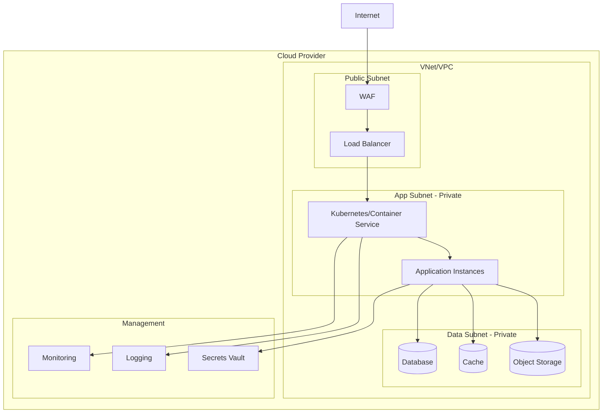

# Infrastructure Specification

## Project Overview
[Brief description of the infrastructure scope and purpose]

## Target Configuration
| Attribute | Value |
|-----------|-------|
| Cloud Providers | [Azure / GCP / Both] |
| IaC Tool | [Terraform / Pulumi] |
| Environments | [dev, qa, staging, prod] |

## Environment Matrix
| Environment | Purpose | Availability | Scale | Approval Required |
|-------------|---------|--------------|-------|-------------------|
| dev | Development & testing | Single AZ | Minimal | None |
| qa | Quality assurance | Single AZ | Reduced | None |
| staging | Pre-production validation | Multi-AZ | Production-like | 1 approver |
| prod | Production workloads | Multi-AZ | Full scale | 2 approvers |

---

## Infrastructure Requirements

### Compute Requirements (INFRA-XXX)
- INFRA-001: System MUST provision [compute resource] with [specification]
- INFRA-002: System MUST configure auto-scaling with [min/max instances]
- INFRA-003: System MUST deploy [container orchestration] for [workload type]
- INFRA-004: [UNCLEAR] System MUST [ambiguous requirement needing clarification]

**Note:** Mark unclear requirements with [UNCLEAR] tag.

### Networking Requirements (INFRA-XXX)
- INFRA-010: System MUST provision VNet/VPC with [CIDR range]
- INFRA-011: System MUST configure [public/private] subnets for [purpose]
- INFRA-012: System MUST implement [load balancer type] for [traffic pattern]
- INFRA-013: System MUST configure [firewall/NSG] rules for [access pattern]
- INFRA-014: [UNCLEAR] System MUST [ambiguous requirement needing clarification]

### Storage Requirements (INFRA-XXX)
- INFRA-020: System MUST provision [storage type] with [capacity/tier]
- INFRA-021: System MUST configure [backup policy] for [data type]
- INFRA-022: System MUST implement [replication strategy] for [availability]
- INFRA-023: [UNCLEAR] System MUST [ambiguous requirement needing clarification]

### Database Requirements (INFRA-XXX)
- INFRA-030: System MUST provision [database service] with [tier/size]
- INFRA-031: System MUST configure [HA/DR strategy] with RTO=[X] RPO=[Y]
- INFRA-032: System MUST implement [read replicas/scaling] for [workload]
- INFRA-033: [UNCLEAR] System MUST [ambiguous requirement needing clarification]

---

## Security Requirements (SEC-XXX)

### Network Security
- SEC-001: System MUST implement [network isolation pattern]
- SEC-002: System MUST configure [WAF/DDoS protection] for public endpoints
- SEC-003: System MUST use private endpoints for [PaaS services]

### Data Security
- SEC-010: System MUST encrypt data at rest using [encryption standard]
- SEC-011: System MUST encrypt data in transit using [TLS version]
- SEC-012: System MUST implement [key management strategy]

### Identity & Access
- SEC-020: System MUST use [managed identity/workload identity] for service auth
- SEC-021: System MUST implement [RBAC/IAM] with least privilege
- SEC-022: System MUST configure [secrets management] using [vault service]

### Compliance
- SEC-030: System MUST comply with [compliance framework: CIS/SOC2/GDPR/PCI-DSS]
- SEC-031: System MUST enable [audit logging] for [resource types]
- SEC-032: [UNCLEAR] System MUST [ambiguous security requirement]

---

## Operations Requirements (OPS-XXX)

### Monitoring
- OPS-001: System MUST collect metrics using [monitoring service]
- OPS-002: System MUST aggregate logs using [logging service]
- OPS-003: System MUST implement distributed tracing using [tracing service]

### Alerting
- OPS-010: System MUST alert on [error rate threshold]
- OPS-011: System MUST alert on [latency threshold]
- OPS-012: System MUST alert on [resource utilization threshold]

### Disaster Recovery
- OPS-020: System MUST support RTO of [X hours/minutes]
- OPS-021: System MUST support RPO of [X hours/minutes]
- OPS-022: System MUST implement [backup frequency] with [retention period]

---

## Environment-Specific Requirements (ENV-XXX)

### Development (dev)
- ENV-001: dev MUST use [minimal resource sizing]
- ENV-002: dev MUST allow [developer access level]

### QA (qa)
- ENV-010: qa MUST use [test data strategy]
- ENV-011: qa MUST support [parallel test execution]

### Staging (staging)
- ENV-020: staging MUST mirror production configuration
- ENV-021: staging MUST use [anonymized/synthetic data]

### Production (prod)
- ENV-030: prod MUST implement multi-AZ deployment
- ENV-031: prod MUST enforce [approval workflow]
- ENV-032: prod MUST restrict access to [authorized personnel]

---

## Architecture Diagram

---

## Cost Estimate

| Environment | Resource Category | Monthly Estimate | Notes |
|-------------|-------------------|------------------|-------|
| dev | Compute | $[XXX] | [sizing notes] |
| dev | Storage | $[XXX] | [capacity notes] |
| dev | Network | $[XXX] | [traffic notes] |
| dev | **Total** | $[XXX] | |
| qa | **Total** | $[XXX] | |
| staging | **Total** | $[XXX] | |
| prod | **Total** | $[XXX] | |

**Cost Optimization Opportunities:**
- [Opportunity 1: e.g., Reserved instances for prod]
- [Opportunity 2: e.g., Spot instances for dev/qa]
- [Opportunity 3: e.g., Auto-shutdown for non-prod]

---

## Requirement Traceability

| INFRA/SEC/OPS/ENV ID | Source Requirement | NFR/TR/DR Reference |
|----------------------|-------------------|---------------------|
| INFRA-001 | [Source description] | NFR-XXX |
| SEC-001 | [Source description] | NFR-XXX |
| OPS-001 | [Source description] | NFR-XXX |

---

## Human Review Checklist

### Resource Sizing
- [ ] Compute sizing matches NFR performance requirements
- [ ] Storage sizing matches DR capacity requirements
- [ ] Database sizing matches expected data volume

### Network Design
- [ ] Network isolation follows security standards
- [ ] Load balancing strategy matches traffic patterns
- [ ] Private endpoints configured for PaaS services

### Security
- [ ] Encryption configured for data at rest and in transit
- [ ] IAM follows least privilege principle
- [ ] Compliance requirements addressed

### Cost
- [ ] Cost estimates are within budget constraints
- [ ] Cost optimization opportunities identified
- [ ] Reserved capacity planned for predictable workloads

### DR/Backup
- [ ] RTO/RPO requirements achievable
- [ ] Backup strategy covers all critical data
- [ ] DR procedure documented and testable

---

## Approval

| Role | Name | Date | Signature |
|------|------|------|-----------|
| Cloud Architect | | | |
| Security Engineer | | | |
| Infrastructure Lead | | | |
