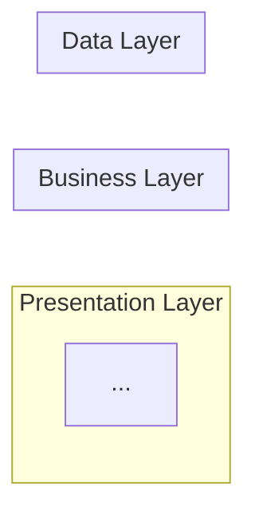
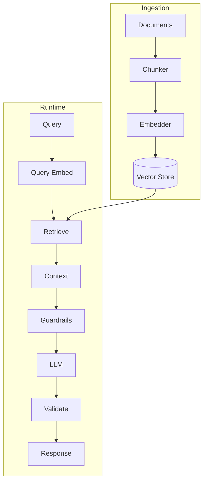
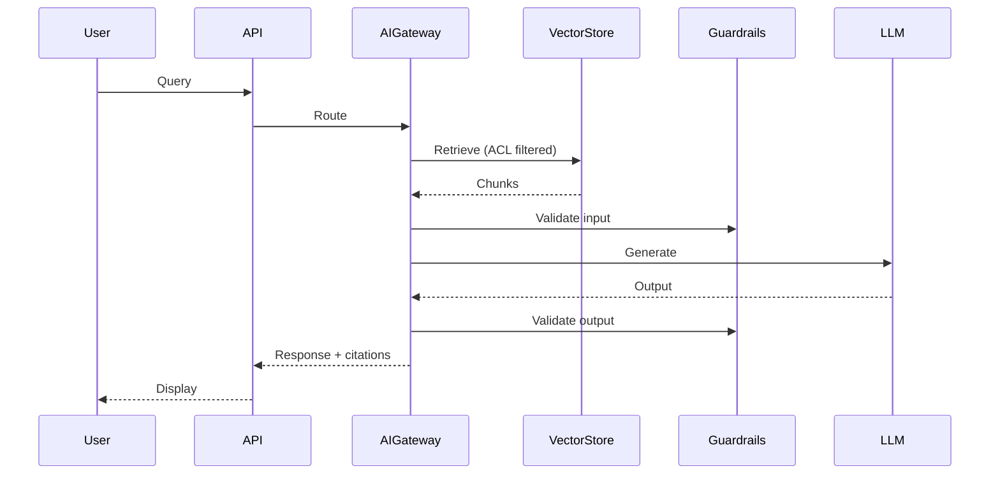

# Design Model Generator

As an expert Software Architect and UML specialist, generate comprehensive visual models and diagrams that represent the system architecture and behavior. This workflow creates all UML artifacts based on requirements from spec.md/codeanalysis.md and architectural decisions from design.md.

## Input Parameter (Requirements File): $ARGUMENTS (Optional)
**Accepts:** File path to spec.md, codeanalysis.md, or requirements document
**Supported File Types:** .md | .txt

### Optional Flags
| Flag | Default | Description |
|------|---------|-------------|
| `--infra-spec` | `none` | Path to infra-spec.md for enhanced deployment diagrams |

### Input Processing Instructions
**CRITICAL**: Before proceeding with model generation, you MUST determine input type and process accordingly:

#### Input Type Detection
1. **File Path Detection**: Check if `$ARGUMENTS` contains a file path (contains file extensions .md, .txt)
2. **Infra-Spec Detection**: Check if `--infra-spec` flag is provided
3. **Default Fallback**: If `$ARGUMENTS` is empty, refer to `.propel/context/docs/spec.md` or `.propel/context/docs/codeanalysis.md`

#### File Input Processing
If `$ARGUMENTS` is a file path:
1. **File Existence Check**: Verify the file exists using appropriate tools
2. **Read File Contents**: Extract content from the provided file
3. **Content Validation**: Ensure file contents contain use case specifications (UC-XXX)

#### Default Input Processing
If `$ARGUMENTS` is not provided:
1. **Spec File Check**: Look for `.propel/context/docs/spec.md` first
2. **Codebase Analysis Fallback**: If spec.md doesn't exist, use `.propel/context/docs/codeanalysis.md`
3. **Design File Required**: Also read `.propel/context/docs/design.md` for architectural context
4. **Infra-Spec Check**: If `.propel/context/devops/infra-spec.md` exists, use it for enhanced deployment diagrams
5. **Content Validation**: Ensure source files contain sufficient use case and architecture information

#### Fallback Handling
- If spec/codeanalysis file cannot be read: Request user to provide alternative file path
- If design.md doesn't exist: Request user to run design-architecture workflow first
- If no use cases found: Request user to ensure spec.md contains UC-XXX specifications

## Output
- Artifact generation: `.propel/context/docs/models.md`
- Print the following:
  - List of rules used by the workflow in bulleted format
  - List of use cases processed (UC-XXX)
  - **4-tier Evaluation Report** (MUST use `evaluate-output.md` workflow - see `Quality Evaluation` section)
  **Do not save as file.** (console output only)

**Note:**
- **File Handling**: IF file exists → UPDATE changed sections only (delta mode). IF file does not exist → CREATE complete file.
- Always create the output file in manageable smaller chunks to manage memory and processing constraints.
- Always generate a single unified document.
- Generate the output using the `.propel/templates/design-model-template.md` template.

## Essential Project Intelligence

### Reference Materials Integration
- **spec.md/codeanalysis.md**: Source of truth for use cases and requirements
- **design.md**: Source of truth for architecture and entities
- **Existing Codebase**: Analyze for actual component names and interactions

*** Comprehensive understanding of both requirements and design is non-negotiable ***

### References Package
```yaml
- file: .propel/context/docs/spec.md
  why: Use case specifications for sequence diagrams

- file: .propel/context/docs/codeanalysis.md
  why: Alternative source for use cases in brown-field projects

- file: .propel/context/docs/design.md
  why: Architecture decisions and entity definitions

- file: .propel/context/devops/infra-spec.md (OPTIONAL)
  why: Concrete INFRA-XXX requirements for enhanced deployment diagrams

- url: [Mermaid documentation]
  why: Syntax reference for diagram generation
```

## Core Principles
- **UC-XXX to Sequence Mapping**: Every use case gets exactly one sequence diagram
- **Design Consistency**: All diagrams align with design.md architectural decisions
- **Standard Notation**: Use Mermaid for most diagrams, PlantUML for Data Flow

## Execution Flow

### 1. Source Analysis
- Read spec.md or codeanalysis.md to extract all use cases (UC-XXX)
- Read design.md to understand architectural decisions and entities
- Generate architectural diagrams based on design.md content
- Generate one sequence diagram for each UC-XXX

### 2. Research Process

#### Requirements Analysis (use Sequential-Thinking MCP)

**Fallback Mechanism:** If the sequential-thinking MCP tool fails or is unavailable, automatically fall back to standard iterative analysis approach using Web fetch:
- Perform systematic step-by-step analysis
- Use structured thinking with explicit validation checkpoints
- Ensure no degradation in analysis quality or completeness

**Requirements Extraction:**
- Parse all use cases (UC-XXX) from spec.md or codeanalysis.md
- Extract actors, goals, preconditions, success scenarios, extensions
- Identify system boundaries and external actors
- Document data flows and process steps

#### Design Context Integration
- Read design.md for architecture goals and patterns
- Extract core entities and their relationships
- Understand technology stack choices
- Map NFR, TR, DR requirements to architectural views

#### External Research
- **Mermaid Documentation**: Use Context7 MCP for Mermaid syntax and best practices
- **PlantUML Documentation**: Reference PlantUML syntax for data flow diagrams
- **UML Standards**: Ensure compliance with UML 2.0 notation standards

### 3. Model Generation Framework

**Before writing diagrams, list all diagrams to generate:**
| Diagram Type | Source | Purpose |
|--------------|--------|---------|
| Conceptual | design.md | High-level architecture |
| Component | design.md | Module breakdown |
| Sequence (per UC-XXX) | spec.md | UC-001, UC-002... |
| ERD | design.md | Data model |
**Now expand each diagram listed above.**

#### UML Models Overview Section
Generate short description explaining:
- Purpose of the UML diagrams
- How diagrams relate to spec.md/codeanalysis.md and design.md
- Navigation guide for the document

#### Architectural Views Generation

**3.1 System Context Diagram (Plantuml)**

- Show system's boundary and its main function
- Interactions with the external entities (users, other systems) via data flows
- Represent high-level system structure

**3.2 Component Architecture Diagram (Mermaid)**

- Break down into individual modules/components
- Show responsibilities and interfaces
- Document component communication paths

**3.3 Deployment Architecture Diagram (plantuml)**

```plantuml
@startuml
...
@enduml
```

- Cloud landing zone deployment view with hub-and-spoke networking: Shared Services (Hub), Workloads (Dev/Test/Prod), Security, and Management.
- Render flow left-to-right with concise labels.
- Use provider-specific sprites/icons when available; otherwise use built-in cloud/node/database shapes.

**IF `--infra-spec` provided OR `.propel/context/devops/infra-spec.md` exists:**
- Enhance diagram with concrete INFRA-XXX requirements (VPC/VNet CIDRs, compute sizing, zones)
- Include SEC-XXX security boundaries (NSG/firewall placement, private endpoints)
- Show ENV-XXX environment separation (dev/qa/staging/prod workload zones)
- Add OPS-XXX monitoring/logging components
- Reference specific cloud services from infra-spec.md (AKS/GKE, Azure SQL/Cloud SQL)

**3.4 Data Flow Diagram (PlantUML)**

- Show data sources and transformations
- Document data stores and their connections
- Visualize data processing pipeline

**3.5 Logical Data Model / ERD (Mermaid)**
```mermaid
erDiagram
    ENTITY1 ||--o{ ENTITY2 : relationship
    ...
```
- Represent entities from design.md Core Entities
- Show attributes and relationships
- Document cardinality and constraints

**3.6 AI Architecture Diagrams** [CONDITIONAL: If design.md contains AIR-XXX]

**RAG Pipeline Diagram (if RAG/Hybrid pattern)**

- Show document ingestion pipeline
- Visualize query runtime flow
- Document guardrails and validation points

**AI Sequence Diagram (per AI-enabled UC-XXX)**

- Generate for each UC-XXX that involves AI components
- Show retrieval, guardrails, and model interactions
- Include ACL filtering and citation generation

#### Sequence Diagrams Generation

**CRITICAL**: Generate ONE sequence diagram for EACH use case (UC-XXX) from spec.md/codeanalysis.md

**For each UC-XXX:**
1. Read use case specification from source document
2. Extract actors, system components (high-level), and data stores
3. Map success scenario steps to message flows
4. Include alternative flows and error handling
5. Generate Mermaid sequence diagram

**Template per UC-XXX:**
```markdown
#### UC-XXX: [Use Case Name]
**Source**: [spec.md#UC-XXX](.propel/context/docs/spec.md#UC-XXX) or [codeanalysis.md#UC-XXX](.propel/context/docs/codeanalysis.md#UC-XXX)

```mermaid
sequenceDiagram
    participant Actor as [Actor Name]
    participant System as [System Component]
    participant Backend as [Backend Service]
    participant Database as [Data Store]

    Note over Actor,Database: UC-XXX - [Use Case Name]

    Actor->>System: [Step 1 from use case]
    System->>Backend: [Internal processing]
    Backend->>Database: [Data operation]
    Database-->>Backend: [Data response]
    Backend-->>System: [Processing result]
    System-->>Actor: [Final outcome]
```

### 4. Design Generation
- Read template from `.propel/templates/design-model-template.md`
- Populate template with all architectural views
- Generate sequence diagrams for each UC-XXX
- Use Write tool to create artifact `.propel/context/docs/models.md`
- Ensure all template sections are populated with real data

### 5. Summary Presentation
- Present executive summary to user
- List all UC-XXX processed with sequence diagrams
- Highlight critical architectural views
- Provide link to detailed models in `.propel/context/docs/models.md`
- Present the Quality Assessment metrics

**Model Validation (use sequential thinking MCP if available):**
- Validate all UC-XXX have sequence diagrams
- Ensure diagrams align with design.md architecture
- Verify ERD matches Core Entities from design.md
- **Fallback**: Create explicit validation checklist and document decision rationale

### Quality Assurance Framework

#### Pre-Delivery Checklist
- [ ] **Use Case Coverage**: All UC-XXX from spec.md/codeanalysis.md have sequence diagrams
- [ ] **Diagram Consistency**: All diagrams align with design.md architecture
- [ ] **Entity Alignment**: ERD entities match design.md Core Entities
- [ ] **Syntax Validation**: All Mermaid/PlantUML code is syntactically correct
- [ ] **Source References**: Each sequence diagram links to source UC-XXX
- [ ] **No Duplicate Use Case Diagrams**: Use case diagrams remain in spec.md only
- [ ] **Template Adherence**: Output follows design-model-template.md structure

## Guardrails
- `rules/ai-assistant-usage-policy.md`: Explicit commands; minimal output
- `rules/dry-principle-guidelines.md`: Single source of truth; delta updates
- `rules/iterative-development-guide.md`: Strict phased workflow
- `rules/markdown-styleguide.md`: Front matter, heading hierarchy, code fences **[CRITICAL]**
- `rules/software-architecture-patterns.md`: Pattern selection, boundaries
- `rules/uml-text-code-standards.md`: PlantUML/Mermaid notation standards **[CRITICAL]**


## Quality Evaluation

**ALWAYS** Execute `.windsurf/workflows/evaluate-output.md` with these parameters:
- `$OUTPUT_FILE`:  `.propel/context/docs/models.md`
- `$SCOPE_FILES`: Input source(s) provided to this workflow
- `--workflow-type`: `model`

**Required Output:**
- Print 4-tier evaluation report to console in tabular format
- Always Use format defined in evaluate-output.md
- Include weighted Overall Score

**Prohibited:**
- Custom evaluation metrics (use evaluate-output.md only)
- Summarizing instead of full report

**Workflow Status:** Incomplete until Step 2 output is printed.

---

*This design model generator ensures comprehensive visual documentation with accurate UML diagrams, use case traceability, and architectural consistency.*
